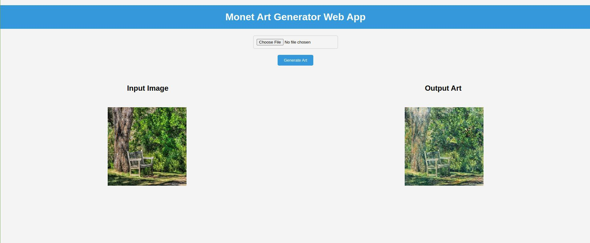

# Monet Art Generator




## Overview

This project is an end-to-end machine learning application that transforms regular input images into art pieces inspired by the style of Claude Monet by employing the CycleGAN model for image-to-image translation.

## References

- **Paper Title:**
  - Author(s): Jun-Yan Zhu, Taesung Park, Phillip Isola, Alexei A. Efros
  - Paper Link: [Unpaired Image-to-Image Translation using Cycle-Consistent Adversarial Networks](https://arxiv.org/abs/1703.10593)

- **Official Repository:**
  - Repository Name: [CycleGAN Repository](https://github.com/junyanz/CycleGAN)

This project re-implements CycleGAN in PyTorch. The model is trained within the project using a dataset sourced from Kaggle, which you can download [here](https://www.kaggle.com/your-username/dataset-name). To integrate the dataset into the project for training, follow these steps:

1. Download the dataset from Kaggle.
2. Unzip the downloaded archive.
3. Move the dataset folder in the working directory of this repository.

The model is deployed as a Flask web app. The application is containerized using Docker for easy deployment.

## Features

- **CycleGAN Model**: Implements the powerful CycleGAN architecture for image-to-image translation.
- **Flask Web App**: Provides a user-friendly interface for uploading and generating art from images.
- **Dockerized**: Easily deploy the application in a Docker container for consistent and reproducible environments.

## Demo


[Live Demo](https://your-app-url.com)

## Getting Started

### Prerequisites

- Python 3.8
- Docker

### Installation

1. Clone the repository:

    ```bash
    git clone https://github.com/Simon1307/gan.git
    cd gan
    ```

2. Create a virtual environment and install dependencies:

    ```bash
    python -m venv venv
    source venv/bin/activate  # On Windows, use `venv\Scripts\activate`
    pip install -r requirements.txt
    ```

3. Train the CycleGAN model:

    ```bash
    python -m src.components.model_trainer
    ```

4. Run the Flask app:

    ```bash
    python app.py
    ```

5. Open your web browser and go to `http://localhost:5000` to access the app.

## Usage

1. Upload an image using the provided interface.
2. Click the "Generate Art" button to transform the image into a Monet-style art piece.
3. Download the generated art.

## Docker

Build the Docker image:

```bash
docker build . -t monet-art-generator
```

Run the Docker container:


```bash
docker run -p 5000:5000 cyclegan-art-translation
```

Access the app at http://localhost:5000 in your browser.
